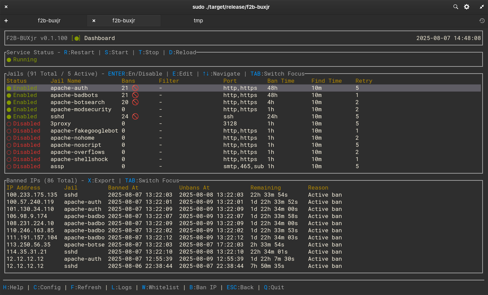

# f2b-buxjr

[](https://opensource.org/licenses/MIT)
[](https://www.rust-lang.org)
[](https://www.kernel.org)

**The first dedicated Terminal User Interface (TUI) for fail2ban administration.**

f2b-buxjr addresses a critical gap in the fail2ban ecosystem by providing system administrators with an intuitive, real-time interface for managing fail2ban without complex command-line operations or security-risky web interfaces.



*f2b-buxjr dashboard showing real-time fail2ban management with 91 total jails, 5 active, and 86 currently banned IPs*

## 🚀 Features

### Core Administration
- **Real-time Jail Management** - Enable/disable jails with immediate visual feedback
- **IP Ban/Unban Operations** - Manage banned IPs with confirmation dialogs
- **Whitelist Management** - Add/remove whitelisted IPs to prevent false positives
- **Service Control** - Start/stop/restart fail2ban service with progress indicators

### Monitoring & Visibility  
- **Live Log Monitoring** - Real-time fail2ban log tail with filtering and search
- **Activity Dashboard** - Recent ban/unban activity with timestamps
- **Service Status** - Real-time fail2ban service health monitoring
- **Ban Statistics** - Current ban counts and jail status overview

### Configuration Management
- **In-TUI Configuration Editor** - Edit jail configurations without leaving the interface
- **Configuration Validation** - Test configurations before applying changes
- **Backup & Restore** - Automatic backups before configuration changes
- **Safe Configuration** - Prevents service-breaking misconfigurations

### User Experience
- **Intuitive Navigation** - Simple keyboard shortcuts (h/c/l/w/etc.)
- **Modal Dialogs** - Clean, focused interfaces for complex operations
- **Error Handling** - Clear error messages with suggested remediation
- **Performance Optimized** - <500ms startup time, <50MB memory usage

## 📦 Installation

### Debian/Ubuntu Package (Recommended)

```bash
# Download latest .deb package from releases
wget https://github.com/buxjr311/f2b-buxjr/releases/latest/download/f2b-buxjr_*_amd64.deb

# Install package
sudo dpkg -i f2b-buxjr_*_amd64.deb

# Run application
sudo f2b-buxjr
```

### From Source

```bash
# Clone repository
git clone https://github.com/buxjr311/f2b-buxjr.git
cd f2b-buxjr

# Build release binary
cargo build --release

# Run directly
sudo ./target/release/f2b-buxjr
```

## 🔧 Requirements

### System Requirements
- **Operating System**: Linux (tested on Debian/Ubuntu)
- **fail2ban**: Version 0.9.0 or higher
- **systemd**: For service management
- **Root/Sudo**: Required for full functionality

### Dependencies
- fail2ban (>= 0.9.0)
- systemd

## 🎮 Usage

### Basic Navigation
- **h** - Help screen
- **c** - Configuration management
- **l** - Live log monitoring  
- **w** - Whitelist management
- **q** - Quit application
- **Tab** - Switch focus between sections
- **↑↓** - Navigate lists and tables
- **Enter** - Select/edit items
- **Escape** - Cancel operations

### Quick Actions
- **B** - Ban IP address
- **R** - Refresh data
- **Space** - Toggle selections
- **/** - Search (context-dependent)

### Getting Started
1. Install f2b-buxjr using one of the methods above
2. Run with sudo privileges: `sudo f2b-buxjr`
3. Press **h** for help and navigation guide
4. Use **Tab** to navigate between dashboard sections
5. Press **c** to view and manage jail configurations

## 🏗️ Architecture

Built with modern Rust technologies:
- **[ratatui](https://github.com/ratatui-org/ratatui)** - Terminal user interface framework
- **[crossterm](https://github.com/crossterm-rs/crossterm)** - Cross-platform terminal handling
- **[serde](https://github.com/serde-rs/serde)** - Configuration parsing
- **[notify](https://github.com/notify-rs/notify)** - Real-time file monitoring

### Design Principles
- **Security First** - Minimal privilege requirements with clear security boundaries
- **Performance** - Efficient algorithms and memory management for production servers
- **Reliability** - Comprehensive error handling and graceful degradation
- **Usability** - Intuitive interface following established TUI conventions

## 🧪 Testing

```bash
# Run test suite
cargo test

# Run integration tests
cargo test --bin test_integration

# Performance benchmarks
cargo run --bin startup_benchmark
```

## 🤝 Contributing

Contributions are welcome! This project follows standard open source practices:

1. **Fork** the repository
2. **Create** a feature branch (`git checkout -b feature/amazing-feature`)
3. **Commit** your changes (`git commit -m 'Add amazing feature'`)
4. **Push** to the branch (`git push origin feature/amazing-feature`)
5. **Open** a Pull Request

### Development Setup

```bash
# Clone your fork
git clone https://github.com/buxjr311/f2b-buxjr.git
cd f2b-buxjr

# Install dependencies
cargo build

# Run in development mode
RUST_LOG=debug cargo run

# Run tests
cargo test
```

## 📋 Roadmap

- [x] Core jail and IP management
- [x] Real-time monitoring and logging
- [x] Configuration backup/restore
- [x] Debian packaging
- [ ] Multi-server management
- [ ] Advanced statistics and reporting
- [ ] Configuration templates
- [ ] Plugin system for custom actions

## 📚 Documentation

- [User Guide](docs/user-guide.md) - Comprehensive usage documentation
- [Configuration](docs/configuration.md) - Advanced configuration options
- [Development](docs/development.md) - Contributing and development guide
- [API Reference](docs/api.md) - Internal API documentation

## 🐛 Bug Reports & Feature Requests

Please use [GitHub Issues](https://github.com/buxjr311/f2b-buxjr/issues) to:
- Report bugs with detailed reproduction steps
- Request new features with use case descriptions
- Ask questions about usage or configuration

## 📄 License

This project is licensed under the MIT License - see the [LICENSE-MIT](LICENSE-MIT) file for details.

## 👥 Acknowledgments

- The [fail2ban](https://github.com/fail2ban/fail2ban) project for providing the core security functionality
- The [ratatui](https://github.com/ratatui-org/ratatui) community for the excellent TUI framework
- System administrators worldwide who inspired this tool's creation

## 🔒 Security

f2b-buxjr is designed with security as a primary concern:
- Minimal privilege requirements
- Input validation and sanitization
- Secure configuration file handling
- No network exposure or remote access

For security concerns, please email: bux@buxjr.com

---

**Made with ❤️ for system administrators**